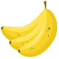
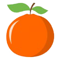
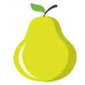
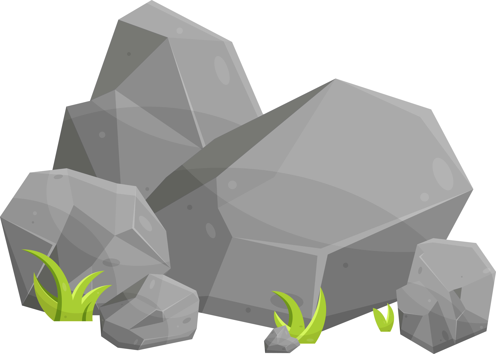

# Snake Game

The snake game is a classic game that involves controlling a snake on a game board, eating fruits, and avoiding obstacles and boundaries. The game is implemented using JavaScript and the HTML5 canvas element.

The game board is a 2D grid of squares, and the player controls the snake using the arrow keys on their keyboard. The snake moves in a continuous motion, and the player can change the direction of the snake by pressing the arrow keys.

The objective of the game is to eat as many fruits as possible to increase the player's score. Each time the snake eats a fruit, it grows longer, and the player must avoid running into the snake's body or the boundaries of the game board or obstacles. If the snake collides with its own body or hits the game board's boundaries or hits the obstacles, the game is over.

The game's difficulty level increases as the player's score increases, with new obstacles added to the game board, and the snake's speed increases. The game also includes a pause feature that allows the player to temporarily stop the game.

The game stores the player's score and game level in the browser's local storage, allowing the player to keep track of their progress across multiple game sessions. The game can also reset the player's score and game history data with a reset button.

The fruits:

The obstacles:

 

